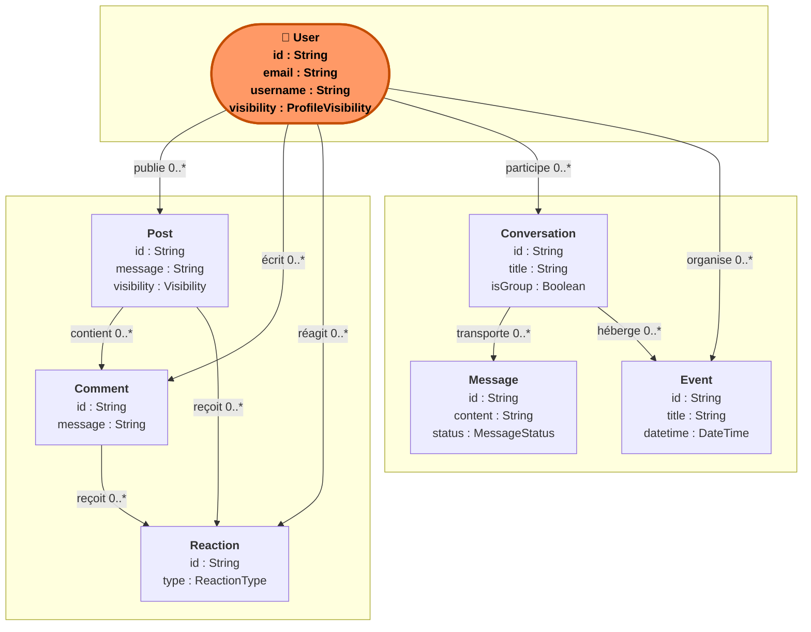
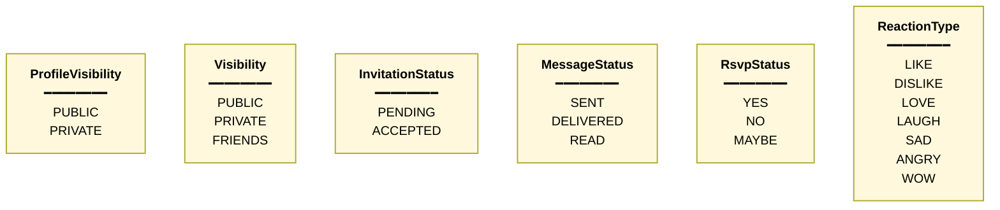
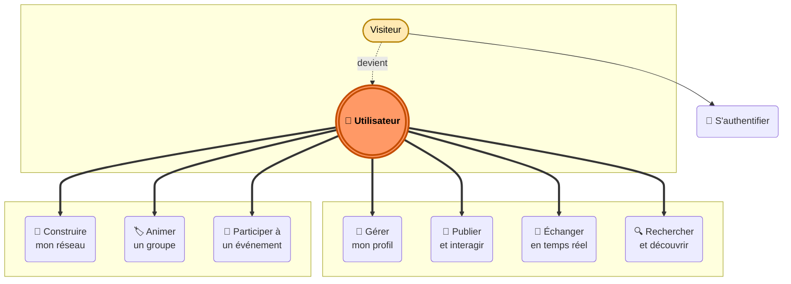

# 📊 Diagrammes UML - Social Network (Conforme Prisma)

## Objectif

Ce document fournit des versions exploitables du modèle de données à partir de la source de vérité du projet: `prisma/schema.prisma`.

- **MCD**: vision conceptuelle (entités et relations)
- **MLD**: vision logique (tables, colonnes, contraintes)
- **MPD**: vision physique PostgreSQL (DDL)

---

## 1. MCD (Modèle Conceptuel de Données)

Copie le code suivant dans [dbdiagram.io](https://dbdiagram.io):

```dbml
// MCD - aligné avec prisma/schema.prisma

Table User {
  id string [pk]
  firstName string
  lastName string
  email string [unique, not null]
  username string [unique]
  password string
  birthDate datetime
  biography text
  avatar string
  avatarId string
  banner string
  bannerId string
  visibility enum [default: 'PUBLIC']
}

Table Account {
  id string [pk]
  userId string [not null]
  provider string [not null]
  providerAccountId string [not null]
  refresh_token string
  access_token string
  expires_at bigint
  token_type string
  scope string
  id_token string
  session_state string
}

Table Post {
  id string [pk]
  userId string [not null]
  message text [not null]
  datetime datetime
  image string
  mediaId string
  visibility enum [default: 'PUBLIC']
}

Table Story {
  id string [pk]
  userId string [not null]
  datetime datetime
  media string
  mediaId string
  visibility enum [default: 'PUBLIC']
}

Table Comment {
  id string [pk]
  postId string [not null]
  userId string [not null]
  message text [not null]
  datetime datetime
}

Table Reaction {
  id string [pk]
  type enum [not null]
  userId string [not null]
  postId string
  storyId string
  commentId string
  datetime datetime
}

Table Message {
  id string [pk]
  senderId string [not null]
  receiverId string [not null]
  message text [not null]
  image string
  datetime datetime
  deliveredAt datetime
  readAt datetime
  status enum [default: 'SENT']
}

Table Friendship {
  id string [pk]
  userId string [not null]
  friendId string [not null]
  status enum [not null]
  createdAt datetime
}

Table Conversation {
  id string [pk]
  title string
  isGroup boolean [default: false]
  createdAt datetime
  ownerId string
}

Table ConversationMember {
  id string [pk]
  userId string [not null]
  conversationId string [not null]
  joinedAt datetime
  lastSeenAt datetime
  lastSeenMessageId string
}

Table GroupMessage {
  id string [pk]
  conversationId string [not null]
  senderId string [not null]
  message text [not null]
  image string
  sentAt datetime
  eventId string
  deliveredAt datetime
  readAt datetime
  status enum [default: 'SENT']
}

Table Event {
  id string [pk]
  title string [not null]
  description text [not null]
  datetime datetime [not null]
  groupId string [not null]
  ownerId string [not null]
  createdAt datetime
}

Table Rsvp {
  id string [pk]
  userId string [not null]
  eventId string [not null]
  status enum [not null]
  createdAt datetime
}

Table GroupInvitation {
  id string [pk]
  groupId string [not null]
  inviterId string [not null]
  invitedId string [not null]
  status enum [default: 'PENDING']
  createdAt datetime
}

Table GroupJoinRequest {
  id string [pk]
  groupId string [not null]
  seeker string [not null]
  status enum [default: 'PENDING']
  createdAt datetime
}

Table GroupMember {
  id string [pk]
  groupId string [not null]
  userId string [not null]
  joinedAt datetime
}

Table Notification {
  id string [pk]
  userId string [not null]
  type string [not null]
  message text [not null]
  isRead boolean [default: false]
  createdAt datetime
}

Table UserSettings {
  id string [pk]
  userId string [not null, unique]
  theme string [default: 'light']
  language string [default: 'en']
  notificationsEnabled boolean [default: true]
  createdAt datetime
}

// Relations
Ref: Account.userId > User.id
Ref: Post.userId > User.id
Ref: Story.userId > User.id
Ref: Comment.postId > Post.id
Ref: Comment.userId > User.id
Ref: Reaction.userId > User.id
Ref: Reaction.postId > Post.id
Ref: Reaction.storyId > Story.id
Ref: Reaction.commentId > Comment.id
Ref: Message.senderId > User.id
Ref: Message.receiverId > User.id
Ref: Friendship.userId > User.id
Ref: Friendship.friendId > User.id
Ref: Conversation.ownerId > User.id
Ref: ConversationMember.userId > User.id
Ref: ConversationMember.conversationId > Conversation.id
Ref: GroupMessage.conversationId > Conversation.id
Ref: GroupMessage.senderId > User.id
Ref: GroupMessage.eventId > Event.id
Ref: Event.groupId > Conversation.id
Ref: Event.ownerId > User.id
Ref: Rsvp.userId > User.id
Ref: Rsvp.eventId > Event.id
Ref: GroupInvitation.groupId > Conversation.id
Ref: GroupInvitation.inviterId > User.id
Ref: GroupInvitation.invitedId > User.id
Ref: GroupJoinRequest.groupId > Conversation.id
Ref: GroupJoinRequest.seeker > User.id
Ref: GroupMember.groupId > Conversation.id
Ref: GroupMember.userId > User.id
Ref: Notification.userId > User.id
Ref: UserSettings.userId > User.id
```

---

## 2. MLD (Modèle Logique de Données)

Version logique en DBML (naming SQL-like) compatible dbdiagram.io.

```dbml
Table users {
  id text [pk]
  first_name varchar(100)
  last_name varchar(100)
  email varchar(255) [unique, not null]
  username varchar(100) [unique]
  password_hash varchar(255)
  birth_date timestamptz
  biography text
  avatar varchar(500)
  avatar_id varchar(255)
  banner varchar(500)
  banner_id varchar(255)
  visibility varchar(20) [default: 'PUBLIC']
}

Table accounts {
  id text [pk]
  user_id text [not null]
  provider varchar(100) [not null]
  provider_account_id varchar(255) [not null]
  refresh_token text
  access_token text
  expires_at bigint
  token_type varchar(50)
  scope text
  id_token text
  session_state text
}

Table posts {
  id text [pk]
  user_id text [not null]
  message text [not null]
  datetime timestamptz [default: `now()`]
  image varchar(500)
  media_id varchar(255)
  visibility varchar(20) [default: 'PUBLIC']
}

Table stories {
  id text [pk]
  user_id text [not null]
  datetime timestamptz [default: `now()`]
  media varchar(500)
  media_id varchar(255)
  visibility varchar(20) [default: 'PUBLIC']
}

Table comments {
  id text [pk]
  post_id text [not null]
  user_id text [not null]
  message text [not null]
  datetime timestamptz [default: `now()`]
}

Table reactions {
  id text [pk]
  type varchar(20) [not null]
  user_id text [not null]
  post_id text
  story_id text
  comment_id text
  datetime timestamptz [default: `now()`]

  indexes {
    (user_id, post_id) [unique]
    (user_id, story_id) [unique]
    (user_id, comment_id) [unique]
  }
}

Table messages {
  id text [pk]
  sender_id text [not null]
  receiver_id text [not null]
  message text [not null]
  image varchar(500)
  datetime timestamptz [default: `now()`]
  delivered_at timestamptz
  read_at timestamptz
  status varchar(20) [default: 'SENT']
}

Table friendships {
  id text [pk]
  user_id text [not null]
  friend_id text [not null]
  status varchar(20) [not null]
  created_at timestamptz [default: `now()`]

  indexes {
    (user_id, friend_id) [unique]
  }
}

Table conversations {
  id text [pk]
  title varchar(255)
  is_group boolean [default: false]
  created_at timestamptz [default: `now()`]
  owner_id text
}

Table conversation_members {
  id text [pk]
  user_id text [not null]
  conversation_id text [not null]
  joined_at timestamptz [default: `now()`]
  last_seen_at timestamptz
  last_seen_message_id text

  indexes {
    (user_id, conversation_id) [unique]
  }
}

Table group_messages {
  id text [pk]
  conversation_id text [not null]
  sender_id text [not null]
  message text [not null]
  image varchar(500)
  sent_at timestamptz [default: `now()`]
  event_id text
  delivered_at timestamptz
  read_at timestamptz
  status varchar(20) [default: 'SENT']
}

Table events {
  id text [pk]
  title varchar(255) [not null]
  description text [not null]
  datetime timestamptz [not null]
  group_id text [not null]
  owner_id text [not null]
  created_at timestamptz [default: `now()`]
}

Table rsvps {
  id text [pk]
  user_id text [not null]
  event_id text [not null]
  status varchar(20) [not null]
  created_at timestamptz [default: `now()`]

  indexes {
    (user_id, event_id) [unique]
  }
}

Table group_invitations {
  id text [pk]
  group_id text [not null]
  inviter_id text [not null]
  invited_id text [not null]
  status varchar(20) [default: 'PENDING']
  created_at timestamptz [default: `now()`]

  indexes {
    (group_id, invited_id) [unique]
  }
}

Table group_join_requests {
  id text [pk]
  group_id text [not null]
  seeker text [not null]
  status varchar(20) [default: 'PENDING']
  created_at timestamptz [default: `now()`]

  indexes {
    (group_id, seeker) [unique]
  }
}

Table group_members {
  id text [pk]
  group_id text [not null]
  user_id text [not null]
  joined_at timestamptz [default: `now()`]

  indexes {
    (group_id, user_id) [unique]
  }
}

Table notifications {
  id text [pk]
  user_id text [not null]
  type varchar(100) [not null]
  message text [not null]
  is_read boolean [default: false]
  created_at timestamptz [default: `now()`]

  indexes {
    (user_id)
  }
}

Table user_settings {
  id text [pk]
  user_id text [not null, unique]
  theme varchar(20) [default: 'light']
  language varchar(10) [default: 'en']
  notifications_enabled boolean [default: true]
  created_at timestamptz [default: `now()`]
}

Ref: accounts.user_id > users.id
Ref: posts.user_id > users.id
Ref: stories.user_id > users.id
Ref: comments.post_id > posts.id
Ref: comments.user_id > users.id
Ref: reactions.user_id > users.id
Ref: reactions.post_id > posts.id
Ref: reactions.story_id > stories.id
Ref: reactions.comment_id > comments.id
Ref: messages.sender_id > users.id
Ref: messages.receiver_id > users.id
Ref: friendships.user_id > users.id
Ref: friendships.friend_id > users.id
Ref: conversations.owner_id > users.id
Ref: conversation_members.user_id > users.id
Ref: conversation_members.conversation_id > conversations.id
Ref: group_messages.conversation_id > conversations.id
Ref: group_messages.sender_id > users.id
Ref: group_messages.event_id > events.id
Ref: events.group_id > conversations.id
Ref: events.owner_id > users.id
Ref: rsvps.user_id > users.id
Ref: rsvps.event_id > events.id
Ref: group_invitations.group_id > conversations.id
Ref: group_invitations.inviter_id > users.id
Ref: group_invitations.invited_id > users.id
Ref: group_join_requests.group_id > conversations.id
Ref: group_join_requests.seeker > users.id
Ref: group_members.group_id > conversations.id
Ref: group_members.user_id > users.id
Ref: notifications.user_id > users.id
Ref: user_settings.user_id > users.id
```

---

## 3. MPD (Modèle Physique de Données - PostgreSQL)

> Remarque: Prisma génère des identifiants `cuid()` côté application, donc les PK sont stockées en `TEXT`.

```sql
-- MPD PostgreSQL aligné sur prisma/schema.prisma

CREATE TABLE users (
  id TEXT PRIMARY KEY,
  first_name VARCHAR(100),
  last_name VARCHAR(100),
  email VARCHAR(255) UNIQUE NOT NULL,
  username VARCHAR(100) UNIQUE,
  password_hash VARCHAR(255),
  birth_date TIMESTAMPTZ,
  biography TEXT,
  avatar VARCHAR(500),
  avatar_id VARCHAR(255),
  banner VARCHAR(500),
  banner_id VARCHAR(255),
  visibility VARCHAR(20) NOT NULL DEFAULT 'PUBLIC'
);

CREATE TABLE accounts (
  id TEXT PRIMARY KEY,
  user_id TEXT NOT NULL REFERENCES users(id) ON DELETE CASCADE,
  provider VARCHAR(100) NOT NULL,
  provider_account_id VARCHAR(255) NOT NULL,
  refresh_token TEXT,
  access_token TEXT,
  expires_at BIGINT,
  token_type VARCHAR(50),
  scope TEXT,
  id_token TEXT,
  session_state TEXT,
  CONSTRAINT accounts_provider_account_unique UNIQUE (provider, provider_account_id)
);

CREATE TABLE posts (
  id TEXT PRIMARY KEY,
  user_id TEXT NOT NULL REFERENCES users(id),
  message TEXT NOT NULL,
  datetime TIMESTAMPTZ NOT NULL DEFAULT NOW(),
  image VARCHAR(500),
  media_id VARCHAR(255),
  visibility VARCHAR(20) NOT NULL DEFAULT 'PUBLIC'
);

CREATE TABLE stories (
  id TEXT PRIMARY KEY,
  user_id TEXT NOT NULL REFERENCES users(id),
  datetime TIMESTAMPTZ NOT NULL DEFAULT NOW(),
  media VARCHAR(500),
  media_id VARCHAR(255),
  visibility VARCHAR(20) NOT NULL DEFAULT 'PUBLIC'
);

CREATE TABLE comments (
  id TEXT PRIMARY KEY,
  post_id TEXT NOT NULL REFERENCES posts(id),
  user_id TEXT NOT NULL REFERENCES users(id),
  message TEXT NOT NULL,
  datetime TIMESTAMPTZ NOT NULL DEFAULT NOW()
);

CREATE TABLE reactions (
  id TEXT PRIMARY KEY,
  type VARCHAR(20) NOT NULL,
  user_id TEXT NOT NULL REFERENCES users(id),
  post_id TEXT REFERENCES posts(id),
  story_id TEXT REFERENCES stories(id),
  comment_id TEXT REFERENCES comments(id),
  datetime TIMESTAMPTZ NOT NULL DEFAULT NOW(),
  CONSTRAINT reactions_user_post_unique UNIQUE (user_id, post_id),
  CONSTRAINT reactions_user_story_unique UNIQUE (user_id, story_id),
  CONSTRAINT reactions_user_comment_unique UNIQUE (user_id, comment_id),
  CONSTRAINT reactions_single_target CHECK (
    (post_id IS NOT NULL AND story_id IS NULL AND comment_id IS NULL) OR
    (post_id IS NULL AND story_id IS NOT NULL AND comment_id IS NULL) OR
    (post_id IS NULL AND story_id IS NULL AND comment_id IS NOT NULL)
  )
);

CREATE TABLE messages (
  id TEXT PRIMARY KEY,
  sender_id TEXT NOT NULL REFERENCES users(id),
  receiver_id TEXT NOT NULL REFERENCES users(id),
  message TEXT NOT NULL,
  image VARCHAR(500),
  datetime TIMESTAMPTZ NOT NULL DEFAULT NOW(),
  delivered_at TIMESTAMPTZ,
  read_at TIMESTAMPTZ,
  status VARCHAR(20) NOT NULL DEFAULT 'SENT'
);

CREATE TABLE friendships (
  id TEXT PRIMARY KEY,
  user_id TEXT NOT NULL REFERENCES users(id),
  friend_id TEXT NOT NULL REFERENCES users(id),
  status VARCHAR(20) NOT NULL,
  created_at TIMESTAMPTZ NOT NULL DEFAULT NOW(),
  CONSTRAINT friendships_user_friend_unique UNIQUE (user_id, friend_id)
);

CREATE TABLE conversations (
  id TEXT PRIMARY KEY,
  title VARCHAR(255),
  is_group BOOLEAN NOT NULL DEFAULT FALSE,
  created_at TIMESTAMPTZ NOT NULL DEFAULT NOW(),
  owner_id TEXT REFERENCES users(id)
);

CREATE TABLE conversation_members (
  id TEXT PRIMARY KEY,
  user_id TEXT NOT NULL REFERENCES users(id),
  conversation_id TEXT NOT NULL REFERENCES conversations(id),
  joined_at TIMESTAMPTZ NOT NULL DEFAULT NOW(),
  last_seen_at TIMESTAMPTZ,
  last_seen_message_id TEXT,
  CONSTRAINT conversation_members_user_conversation_unique UNIQUE (user_id, conversation_id)
);

CREATE TABLE events (
  id TEXT PRIMARY KEY,
  title VARCHAR(255) NOT NULL,
  description TEXT NOT NULL,
  datetime TIMESTAMPTZ NOT NULL,
  group_id TEXT NOT NULL REFERENCES conversations(id),
  owner_id TEXT NOT NULL REFERENCES users(id),
  created_at TIMESTAMPTZ NOT NULL DEFAULT NOW()
);

CREATE TABLE group_messages (
  id TEXT PRIMARY KEY,
  conversation_id TEXT NOT NULL REFERENCES conversations(id),
  sender_id TEXT NOT NULL REFERENCES users(id),
  message TEXT NOT NULL,
  image VARCHAR(500),
  sent_at TIMESTAMPTZ NOT NULL DEFAULT NOW(),
  event_id TEXT REFERENCES events(id) ON DELETE CASCADE,
  delivered_at TIMESTAMPTZ,
  read_at TIMESTAMPTZ,
  status VARCHAR(20) NOT NULL DEFAULT 'SENT'
);

CREATE TABLE rsvps (
  id TEXT PRIMARY KEY,
  user_id TEXT NOT NULL REFERENCES users(id),
  event_id TEXT NOT NULL REFERENCES events(id),
  status VARCHAR(20) NOT NULL,
  created_at TIMESTAMPTZ NOT NULL DEFAULT NOW(),
  CONSTRAINT rsvps_user_event_unique UNIQUE (user_id, event_id)
);

CREATE TABLE group_invitations (
  id TEXT PRIMARY KEY,
  group_id TEXT NOT NULL REFERENCES conversations(id),
  inviter_id TEXT NOT NULL REFERENCES users(id),
  invited_id TEXT NOT NULL REFERENCES users(id),
  status VARCHAR(20) NOT NULL DEFAULT 'PENDING',
  created_at TIMESTAMPTZ NOT NULL DEFAULT NOW(),
  CONSTRAINT group_invitations_group_invited_unique UNIQUE (group_id, invited_id)
);

CREATE TABLE group_join_requests (
  id TEXT PRIMARY KEY,
  group_id TEXT NOT NULL REFERENCES conversations(id),
  seeker TEXT NOT NULL REFERENCES users(id),
  status VARCHAR(20) NOT NULL DEFAULT 'PENDING',
  created_at TIMESTAMPTZ NOT NULL DEFAULT NOW(),
  CONSTRAINT group_join_requests_group_seeker_unique UNIQUE (group_id, seeker)
);

CREATE TABLE group_members (
  id TEXT PRIMARY KEY,
  group_id TEXT NOT NULL REFERENCES conversations(id),
  user_id TEXT NOT NULL REFERENCES users(id),
  joined_at TIMESTAMPTZ NOT NULL DEFAULT NOW(),
  CONSTRAINT group_members_group_user_unique UNIQUE (group_id, user_id)
);

CREATE TABLE notifications (
  id TEXT PRIMARY KEY,
  user_id TEXT NOT NULL REFERENCES users(id),
  type VARCHAR(100) NOT NULL,
  message TEXT NOT NULL,
  is_read BOOLEAN NOT NULL DEFAULT FALSE,
  created_at TIMESTAMPTZ NOT NULL DEFAULT NOW()
);

CREATE TABLE user_settings (
  id TEXT PRIMARY KEY,
  user_id TEXT NOT NULL UNIQUE REFERENCES users(id),
  theme VARCHAR(20) NOT NULL DEFAULT 'light',
  language VARCHAR(10) NOT NULL DEFAULT 'en',
  notifications_enabled BOOLEAN NOT NULL DEFAULT TRUE,
  created_at TIMESTAMPTZ NOT NULL DEFAULT NOW()
);

CREATE INDEX idx_notifications_user_id ON notifications(user_id);
```

---

## 4. Diagramme de Classes (UML)

Le diagramme de classes formalise les 18 entités persistées par Prisma, leurs attributs typés et les relations entre elles. Il est aligné mot pour mot sur `prisma/schema.prisma`.

### 4.1 Version simplifiée (pour la slide de soutenance)

Sept entités cœur, layout **radial** avec User au centre. Représenté en `flowchart` (avec attributs en multi-ligne) plutôt qu'en `classDiagram` car ce dernier ne permet pas de forcer un placement radial — l'algorithme dagre place les classes en ligne ou en colonne. Pour la version stricte UML avec accolades, voir 4.2.



> Cette version est volontairement orientée « domaine métier ». Les entités techniques (`Account`, `UserSettings`, `Notification`, `GroupInvitation`, `GroupJoinRequest`, `ConversationMember`, `GroupMember`, `Rsvp`, `Story`, `Friendship`) sont citées à l'oral mais reportées dans la version complète ci-dessous pour ne pas saturer la slide.

### 4.2 Version complète (référence pour le dossier écrit)

Les 18 entités persistées, leurs attributs typés et leurs relations.

```mermaid
classDiagram
  direction TB

  class User {
    +String id PK
    +String firstName
    +String lastName
    +String password
    +String email UK
    +DateTime birthDate
    +String username UK
    +String biography
    +String avatar
    +String avatarId
    +String banner
    +String bannerId
    +ProfileVisibility visibility
  }
  class Account {
    +String id PK
    +String userId FK
    +String provider
    +String providerAccountId
    +String refresh_token
    +String access_token
    +BigInt expires_at
    +String token_type
    +String scope
    +String id_token
    +String session_state
  }
  class Post {
    +String id PK
    +String userId FK
    +String message
    +DateTime datetime
    +String image
    +String mediaId
    +Visibility visibility
  }
  class Story {
    +String id PK
    +String userId FK
    +DateTime datetime
    +String media
    +String mediaId
    +Visibility visibility
  }
  class Comment {
    +String id PK
    +String postId FK
    +String userId FK
    +String message
    +DateTime datetime
  }
  class Reaction {
    +String id PK
    +ReactionType type
    +String userId FK
    +String postId FK
    +String storyId FK
    +String commentId FK
    +DateTime datetime
  }
  class Message {
    +String id PK
    +String senderId FK
    +String receiverId FK
    +String message
    +String image
    +DateTime datetime
    +DateTime deliveredAt
    +DateTime readAt
    +MessageStatus status
  }
  class Friendship {
    +String id PK
    +String userId FK
    +String friendId FK
    +InvitationStatus status
    +DateTime createdAt
  }
  class Conversation {
    +String id PK
    +String title
    +Boolean isGroup
    +DateTime createdAt
    +String ownerId FK
  }
  class ConversationMember {
    +String id PK
    +String userId FK
    +String conversationId FK
    +DateTime joinedAt
    +DateTime lastSeenAt
    +String lastSeenMessageId
  }
  class GroupMessage {
    +String id PK
    +String conversationId FK
    +String senderId FK
    +String message
    +String image
    +DateTime sentAt
    +String eventId FK
    +DateTime deliveredAt
    +DateTime readAt
    +MessageStatus status
  }
  class GroupInvitation {
    +String id PK
    +String groupId FK
    +String inviterId FK
    +String invitedId FK
    +InvitationStatus status
    +DateTime createdAt
  }
  class GroupJoinRequest {
    +String id PK
    +String groupId FK
    +String seeker FK
    +InvitationStatus status
    +DateTime createdAt
  }
  class GroupMember {
    +String id PK
    +String groupId FK
    +String userId FK
    +DateTime joinedAt
  }
  class Event {
    +String id PK
    +String title
    +String description
    +DateTime datetime
    +String groupId FK
    +String ownerId FK
    +DateTime createdAt
  }
  class Rsvp {
    +String id PK
    +String userId FK
    +String eventId FK
    +RsvpStatus status
    +DateTime createdAt
  }
  class Notification {
    +String id PK
    +String userId FK
    +String type
    +String message
    +Boolean isRead
    +DateTime createdAt
  }
  class UserSettings {
    +String id PK
    +String userId FK UK
    +String theme
    +String language
    +Boolean notificationsEnabled
    +DateTime createdAt
  }

  User "1" --> "0..*" Post : crée
  User "1" --> "0..*" Story : crée
  User "1" --> "0..*" Comment : écrit
  User "1" --> "0..*" Reaction : réagit
  User "1" --> "0..*" Message : envoie
  User "1" --> "0..*" Notification : reçoit
  User "1" --> "0..1" UserSettings : possède
  User "1" --> "0..*" Account : authentifie via
  User "1" --> "0..*" Friendship : initie
  User "1" --> "0..*" Conversation : possède
  User "1" --> "0..*" ConversationMember : participe
  User "1" --> "0..*" GroupMessage : envoie
  User "1" --> "0..*" GroupMember : adhère
  User "1" --> "0..*" GroupInvitation : invite
  User "1" --> "0..*" GroupJoinRequest : demande
  User "1" --> "0..*" Event : organise
  User "1" --> "0..*" Rsvp : répond

  Post "1" --> "0..*" Comment : contient
  Post "1" --> "0..*" Reaction : reçoit
  Story "1" --> "0..*" Reaction : reçoit
  Comment "1" --> "0..*" Reaction : reçoit

  Conversation "1" --> "0..*" ConversationMember : a pour membres
  Conversation "1" --> "0..*" GroupMessage : contient
  Conversation "1" --> "0..*" GroupMember : enregistre
  Conversation "1" --> "0..*" GroupInvitation : émet
  Conversation "1" --> "0..*" GroupJoinRequest : reçoit
  Conversation "1" --> "0..*" Event : héberge

  Event "1" --> "0..*" Rsvp : collecte
  Event "1" --> "0..*" GroupMessage : référencé par
```



**Notes UML :**

- Les méthodes des classes ne sont pas modélisées ici : ce sont des entités de persistance, pas des classes métier au sens objet classique. Le comportement vit dans la couche `src/lib/server/...` (queries Prisma) et dans les routes API.
- Les contraintes d'unicité composite (`@@unique`) sont omises pour la lisibilité : `Reaction(userId,postId)` / `(userId,storyId)` / `(userId,commentId)`, `Friendship(userId,friendId)`, `ConversationMember(userId,conversationId)`, `GroupInvitation(groupId,invitedId)`, `GroupJoinRequest(groupId,seeker)`, `GroupMember(groupId,userId)`, `Rsvp(userId,eventId)`, `Account(provider,providerAccountId)`.
- Tous les `id` sont des `cuid()` (chaîne, pas `int`).
- Les enums sont définis dans la section 4.3.

### 4.3 Enums

Les 6 énumérations utilisées par le schéma Prisma. Représentées en `flowchart` (un bloc par enum) plutôt qu'en `classDiagram` car la version 11+ de Mermaid plante sur un `classDiagram` sans aucune relation.



---

## 5. Diagramme de Cas d'Utilisation (UML)

Représente les interactions entre les **acteurs** du système et les **cas d'utilisation** offerts par l'application, déduits des endpoints réellement exposés dans `src/app/api/`.

### 5.1 Acteurs

| Acteur | Description | Périmètre |
|---|---|---|
| **Visiteur** | Utilisateur non authentifié | Routes `/api/public/auth/*` uniquement |
| **Utilisateur** | Utilisateur authentifié (cookie `authToken` valide) | Toutes les routes `/api/private/*` |
| **Auteur de contenu** | Spécialisation : utilisateur ayant créé un post / story / comment / réaction | Modifier ou supprimer son propre contenu |
| **Propriétaire de groupe** | Spécialisation : utilisateur ayant créé un groupe (`Conversation.ownerId`) | Inviter, accepter les demandes, modifier, supprimer le groupe |
| **Organisateur d'événement** | Spécialisation : utilisateur ayant créé un événement (`Event.ownerId`) | Modifier ou supprimer l'événement |

> **Note importante pour le jury :** il n'existe pas de rôle « administrateur » ou « modérateur » distinct dans le projet. La modération est exclusivement assurée par les **propriétaires** de leurs propres contenus et groupes. C'est un choix de scope assumé du projet de formation. Un futur rôle Admin (et l'écran de modération associé) est listé en axe d'évolution dans `06-bilan`.

### 5.2 Vue d'ensemble (Mermaid)

Layout **radial** : l'acteur **Utilisateur** est positionné au centre, entouré de 8 domaines fonctionnels (4 au-dessus, 4 en-dessous) et flanqué des acteurs satellites (Visiteur à gauche, Propriétaire de groupe et Organisateur d'événement à droite). Chaque domaine regroupe ses cas d'utilisation, et l'Utilisateur est relié à chacun d'eux par une seule flèche « participe à ». Les cas redondants ont été regroupés pour la lisibilité.

```mermaid
flowchart TB
  %% ============================================
  %% RANGÉE 0 — Acteurs satellites (tout en haut)
  %% ============================================
  subgraph ACTORS [" "]
    direction LR
    V([Visiteur]):::actor
    PG([Propriétaire de groupe]):::actor
    OE([Organisateur d'événement]):::actor
  end

  %% ============================================
  %% RANGÉE 1 — 4 domaines satellites haut
  %% ============================================
  subgraph TOP [" "]
    direction LR

    subgraph AUTH["🔐 Authentification"]
      direction TB
      UC_register(S'inscrire)
      UC_login(Se connecter)
      UC_google(Via Google)
      UC_logout(Se déconnecter)
    end

    subgraph PROFILE["👤 Profil"]
      direction TB
      UC_viewMe(Mon profil)
      UC_editMe(Modifier profil)
      UC_settings(Paramètres)
      UC_viewProfile(Profil d'autrui)
    end

    subgraph SEARCH["🔍 Recherche"]
      direction TB
      UC_search(Contenu)
      UC_searchUsers(Utilisateurs)
    end

    subgraph SOCIAL["👥 Relations"]
      direction TB
      UC_friend(Demande d'amitié)
      UC_follow(Suivre / Désabonner)
      UC_followers(Voir followers)
    end
  end

  %% ============================================
  %% RANGÉE 2 — Acteur central (User seul)
  %% ============================================
  U(((👤 Utilisateur))):::central

  %% Héritage des spécialisations (vers les acteurs en haut)
  U -. spécialise .-> PG
  U -. spécialise .-> OE

  %% ============================================
  %% RANGÉE 3 — 4 domaines satellites bas
  %% ============================================
  subgraph BOTTOM [" "]
    direction LR

    subgraph FEED["📝 Publications"]
      direction TB
      UC_feed(Feed et reels)
      UC_post(Publier un post)
      UC_viewPost(Voir un post)
      UC_comment(Commenter)
      UC_react(Réagir)
      UC_story(Stories)
    end

    subgraph CHAT["💬 Messagerie"]
      direction TB
      UC_listConv(Conversations)
      UC_send(Envoyer un message)
      UC_listenSSE(Réception SSE)
      UC_typing(Typing)
      UC_seen(Marquer comme lu)
    end

    subgraph GROUPS["🏷️ Groupes"]
      direction TB
      UC_listGroups(Mes groupes)
      UC_createGroup(Créer un groupe)
      UC_joinReq(Demander à rejoindre)
      UC_acceptInvite(Accepter invitation)
      UC_leaveGroup(Quitter)
      UC_manageGroup(Modifier / Supprimer)
      UC_inviteMember(Inviter / Retirer)
      UC_respondReq(Traiter demandes)
    end

    subgraph EVENTS["📅 Événements"]
      direction TB
      UC_listEvents(Voir événements)
      UC_createEvent(Créer un événement)
      UC_rsvp(RSVP)
      UC_manageEvent(Modifier / Supprimer)
    end
  end

  %% ============================================
  %% LIAISONS — radiales depuis l'acteur central
  %% ============================================

  %% Visiteur → seulement l'auth
  V ==> AUTH

  %% Utilisateur central → tous les domaines
  U ==> AUTH
  U ==> PROFILE
  U ==> SEARCH
  U ==> SOCIAL
  U ==> FEED
  U ==> CHAT
  U ==> GROUPS
  U ==> EVENTS

  %% Acteurs spécialisés → cas spécifiques
  PG -.modère.-> UC_manageGroup
  PG -.modère.-> UC_inviteMember
  PG -.modère.-> UC_respondReq
  OE -.organise.-> UC_manageEvent

  classDef actor fill:#ffe9b3,stroke:#b8860b,stroke-width:2px,color:#000;
  classDef central fill:#ff9966,stroke:#c44d00,stroke-width:3px,color:#000,font-weight:bold;
```



**Lecture du diagramme :**

- Le **cercle orange** au centre représente l'acteur **Utilisateur** (rôle de base, hérité par tous les acteurs authentifiés).
- Les flèches épaisses (`==>`) partent de l'Utilisateur vers chaque **domaine** (subgraph) — l'Utilisateur « participe à » tout le domaine.
- Les **acteurs spécialisés** (Propriétaire de groupe, Organisateur d'événement) sont liés directement aux cas spécifiques qu'ils débloquent (flèches en pointillés).
- Le **Visiteur** ne peut accéder qu'au domaine Authentification.

### 5.3 Version simplifiée (pour la slide de soutenance)

Même logique radiale : Utilisateur au cœur, 7 domaines d'usage en satellites — optimisé pour une slide paysage 16:9.



### 5.4 Mapping cas d'utilisation → endpoints réels

Pour la défense devant le jury, ce tableau permet de pointer directement le code à l'écran.

| Cas d'utilisation | Endpoint(s) `src/app/api/...` |
|---|---|
| S'inscrire | `POST /public/auth/register` |
| Se connecter | `POST /public/auth/login` |
| Se connecter via Google | `GET /public/auth/redirect/google` → `GET /public/auth/callback/google` |
| Se déconnecter | `POST /public/auth/logout` |
| Consulter mon profil | `GET /private/me` (complet) ou `GET /user/me` (id seul) |
| Modifier mon profil | `PUT /private/me` |
| Modifier mes paramètres | `PATCH /private/user/settings` |
| Consulter un profil | `GET /private/user/[userId]` + `GET /private/profile/[userId]/summary` |
| Consulter le feed | `GET /private/post/getAllPosts` |
| Consulter les reels | `GET /private/post/getVideoReels` |
| Publier un post | `POST /private/post` |
| Voir un post | `GET /private/post/[id]` |
| Voir les posts d'un profil | `GET /private/post/profile/[userId]` |
| Commenter un post | `POST /private/post/[id]/comments` |
| Réagir / Retirer une réaction | `PUT /private/reaction` / `DELETE /private/reaction/[id]` |
| Publier / Voir les stories | `POST /private/stories` / `GET /private/stories` |
| Rechercher | `GET /private/search` + `GET /private/users/search` + `GET /private/chat/search-users` |
| Demande d'amitié | `POST /private/friend-requests` / `PATCH /private/friend-requests/[requestId]` |
| Statut d'amitié | `GET /private/friend-requests/status/[userId]` |
| Suivre / Se désabonner | `POST /private/follow/[id]` / `DELETE /private/unfollow/[id]` |
| Lister followers/following | `GET /private/follow/[id]/followers` et `/following` |
| Stats follow | `GET /private/follow/stats/[id]` |
| Lister conversations | `GET /private/chat/conversations` |
| Lister messages | `GET /private/chat/messages` + `GET /private/messages` |
| Envoyer un message | `POST /private/chat/send` |
| Recevoir messages temps réel | `GET /private/chat/listen` *(SSE)* |
| Indicateur de saisie | `POST /private/chat/typing` + `GET /private/chat/typing/listen` *(SSE)* |
| Marquer comme lu | `POST /private/conversations/[id]/mark-seen` + équivalents DM + `PUT /private/messages/[id]/status` |
| Compteur non-lus | `GET /private/conversations/[id]/unread-count` + `GET /private/notifications/unread-messages` |
| Lister mes groupes | `GET /private/groups` |
| Créer un groupe | `POST /private/groups/create` (ou `POST /private/groups`) |
| Voir un groupe | `GET /private/groups/[id]` |
| Modifier / Supprimer un groupe | `PUT /private/groups/[id]` / `DELETE /private/groups/[id]` |
| Inviter un membre | `POST /private/groups/[id]/invite` ou `POST /private/groups/[id]/invitations` |
| Demander à rejoindre | `POST /private/groups/[id]/join-request` |
| Répondre à une invitation | `POST /private/groups/[id]/respond-invite` + `PUT /private/invitations/[id]` |
| Répondre à une demande d'adhésion | `POST /private/groups/[id]/respond-request` |
| Quitter un groupe | `POST /private/groups/[id]/leave` |
| Retirer un membre | `DELETE /private/groups/[id]/members` |
| Lister les invitations reçues | `GET /private/invitations` + `GET /private/groups/[id]/invitations` |
| Lister les événements | `GET /private/events` |
| Voir un événement | `GET /private/events/[id]` |
| Événements à venir | `GET /private/notifications/upcoming-events` |
| Créer un événement | `POST /private/events` ou `POST /private/groups/[id]/events` |
| Modifier / Supprimer un événement | `PUT /private/events/[id]` / `DELETE /private/events/[id]` |
| RSVP / Annuler RSVP | `POST /private/events/[id]/rsvp` / `DELETE /private/events/[id]/rsvp` |

---

## Utilisation

- **MCD / MLD** : coller dans dbdiagram.io pour visualiser les relations.
- **MPD** : utiliser comme base SQL de référence pour expliquer la structure physique pendant la soutenance.
- **Diagramme de classes** : section 4 ci-dessus, rendu Mermaid sur GitHub ou via [mermaid.live](https://mermaid.live) pour export PNG/SVG en vue d'intégration dans le diaporama.
- **Diagramme de cas d'utilisation** : section 5 ci-dessus, même méthode d'export.
- **Conformité** : ce document suit les noms de modèles, champs et contraintes de `prisma/schema.prisma` et la liste exhaustive des routes de `src/app/api/`.
