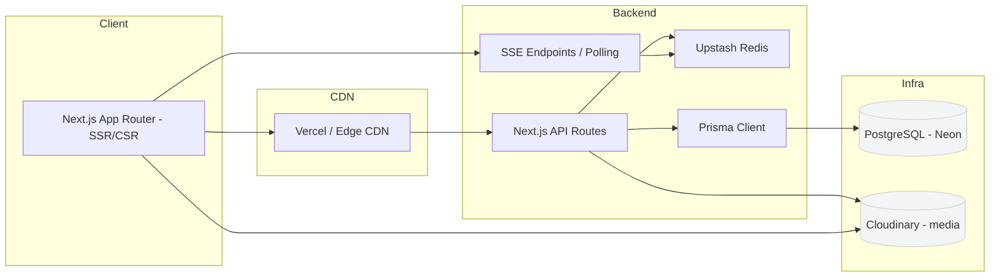
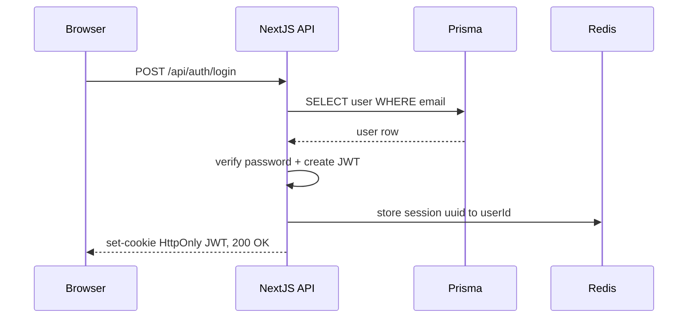
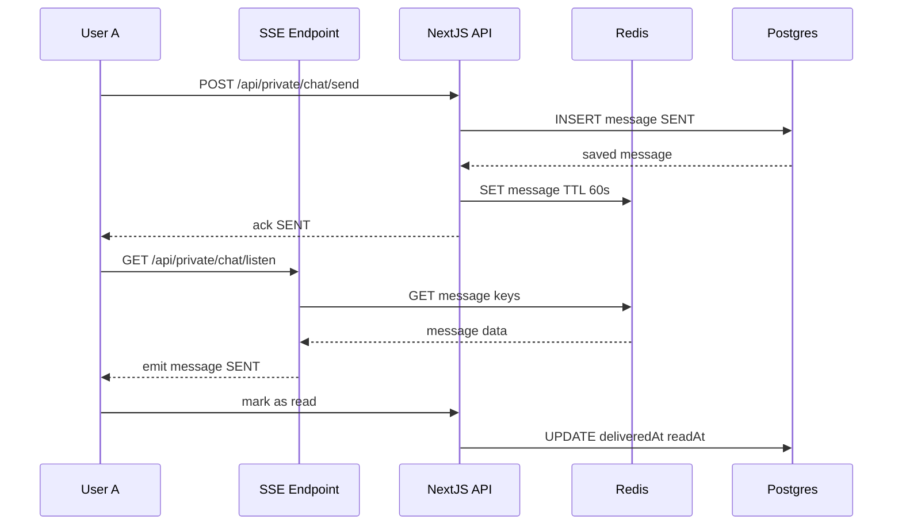
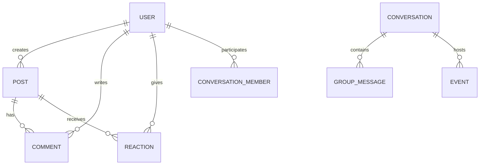

# 04 - Développement

## Objectif

Documenter l'architecture applicative, les endpoints API, l'authentification, le temps réel et la stratégie de tests/CI.

### Preuves & Mapping GitHub

Les éléments techniques présentés ici sont issus des tickets et PRs du dépôt `arocchet/social-network` (références utiles pour le jury et la revue):

- [PR stabilisation (Docker/Neon/Prisma/Redis)]([PR #118](https://github.com/arocchet/social-network/pull/118))
- [DevOps / Docker / CI]([Issue #40](https://github.com/arocchet/social-network/issues/40))
- [Socket/chat system]([Issue #37](https://github.com/arocchet/social-network/issues/37))
- [Notifications & endpoints]([Issue #39](https://github.com/arocchet/social-network/issues/39))
- [Database / Prisma migrations]([Issue #45](https://github.com/arocchet/social-network/issues/45))

Le socle technique a été stabilisé sur la base de ces sujets GitHub.

---

## Diagrammes d'Architecture (Mermaid)

### Architecture Système



### Auth Flow (Login)



### Real-time Messaging Sequence (SSE + Redis Polling)



### Schéma ER (Simplifié)



---

## Authentification & Middleware

- Auth via JWT stocké en cookie HTTP-only; refresh tokens optionnels.
- Middleware Next.js valide JWT sur routes protégées (server-side) et redirige vers `/login` si absent/expiré.
- Sessions courtes côté serveur (Redis) pour invalidation forcée et gestion multi-device.

Pattern recommandé:

- `middleware.ts` vérifie cookie, charge user id, attache `request.user` pour handlers.

---

## Temps réel (Upstash Redis + SSE Polling)

- Architecture: Client poll les endpoints SSE toutes les 500ms via Upstash Redis.
- Evénements principaux (via Redis keys):
  - `message:{conversationId}:{messageId}` → contenu du message
  - `message:status:{messageId}` → SENT / DELIVERED / READ
  - `notification:user:{userId}` → nouvelles notifications
  - `typing:{conversationId}:{userId}` → indicateur de frappe
- Persistance: Prisma → PostgreSQL pour le stockage durable + Redis (60s TTL) pour le temps réel.
- Avantage: Haute disponibilité (pas de connexion persistante), compatible Vercel serverless.

---

## Endpoints API

**Documentation Complète:** [api-spec.md](./api-spec.md)

### Résumé Rapide

**Auth:**

- `POST /api/auth/login` — Connexion
- `POST /api/auth/register` — Inscription
- `POST /api/auth/logout` — Déconnexion

**Users:**

- `GET /api/user/me` — ID utilisateur
- `GET /api/private/me` — Profil complet
- `PUT /api/private/me` — Modifier profil

**Posts:**

- `GET /api/private/post` — Lister posts
- `POST /api/private/post` — Créer post

**Stories:**

- `GET /api/private/stories` — Lister stories
- `POST /api/private/stories` — Créer story

**Messages:**

- `GET /api/private/messages` — Récupérer messages
- `GET /api/private/conversations` — Lister conversations

**Groupes:**

- `GET /api/private/groups` — Lister groupes
- `POST /api/private/groups` — Créer groupe

**Événements:**

- `GET /api/private/events` — Lister événements
- `POST /api/private/events` — Créer événement

**Amitié:**

- `GET /api/private/friend-requests` — Demandes reçues
- `POST /api/private/friend-requests` — Envoyer demande

**Recherche:**

- `GET /api/private/search` — Rechercher users/posts

**Invitations:**

- `GET /api/private/invitations` — Invitations groupe

**→ Voir [api-spec.md](./api-spec.md) pour détails complets (payloads, réponses, erreurs).**

---

## Implémentation - Code Samples

### Authentification (Middleware)

**`src/middleware.ts`** — Valide JWT et charge user ID sur routes protégées:

```typescript
import { NextRequest, NextResponse } from "next/server";

export function middleware(request: NextRequest) {
  const token = request.cookies.get("auth_token")?.value;

  // Redirect to login if no token
  if (!token && request.nextUrl.pathname.startsWith("/api/private")) {
    return NextResponse.json({ error: "Unauthorized" }, { status: 401 });
  }

  // Continue if token exists or public route
  return NextResponse.next();
}

export const config = {
  matcher: ["/api/private/:path*", "/(feed)/:path*"],
};
```

### API Route Sample

**`src/app/api/private/post/route.ts`** — Créer et lister posts:

```typescript
import { NextRequest, NextResponse } from "next/server";
import { getUserIdFromRequest } from "@/lib/server/api/getUserId";
import { respondSuccess, respondError } from "@/lib/server/api/response";

export async function POST(req: NextRequest) {
  const userId = await getUserIdFromRequest(req);
  if (!userId) {
    return NextResponse.json(respondError("Unauthorized"), { status: 401 });
  }

  const formData = await req.formData();
  const message = formData.get("message") as string;
  const image = formData.get("image") as File;

  // Create post in database via Prisma
  const post = await db.post.create({
    data: {
      userId,
      message,
      image: image ? await uploadToCloudinary(image) : null,
      visibility: "PUBLIC",
    },
  });

  return NextResponse.json(respondSuccess(post), { status: 201 });
}
```

### Real-time avec Redis + SSE Polling

**`src/app/api/private/chat/send/route.ts`** — Envoie et stocke messages:

```typescript
import { NextRequest, NextResponse } from "next/server";
import { db } from "@/lib/db";
import { redisdb } from "@/lib/server/websocket/redis";

export async function POST(req: NextRequest) {
  const { senderId, receiverId, message } = await req.json();

  // Persist in database
  const msg = await db.message.create({
    data: { senderId, receiverId, message, status: "SENT" },
  });

  // Store in Redis with 60s TTL for real-time sync
  await redisdb.set(`message:${msg.id}`, JSON.stringify(msg), { ex: 60 });
  await redisdb.set(`message:status:${msg.id}`, "SENT", { ex: 60 });

  return NextResponse.json(msg, { status: 201 });
}
```

**`src/app/api/private/chat/listen/route.ts`** — SSE endpoint pour polling:

```typescript
import { NextRequest } from "next/server";
import { redisdb } from "@/lib/server/websocket/redis";

export async function GET(req: NextRequest) {
  const userId = req.headers.get("x-user-id");

  const stream = new ReadableStream({
    async start(controller) {
      while (true) {
        // Check Redis for new messages every 500ms
        const keys = await redisdb.keys(`message:*`);
        const messages = await Promise.all(keys.map((k) => redisdb.get(k)));

        controller.enqueue(`data: ${JSON.stringify(messages)}\n\n`);
        await new Promise((r) => setTimeout(r, 500));
      }
    },
  });

  return new Response(stream, {
    headers: { "Content-Type": "text/event-stream" },
  });
}
```

---

## Tests & CI/CD

### Tests

**Stratégie recommandée:**

- Unit tests: Jest + React Testing Library
- Integration tests: Jest + Testing Library for API routes
- Contract tests pour événements temps réel (optionnel)

**Sample test (`__tests__/integrations/auth.test.ts`):**

```typescript
import { POST } from "@/app/api/auth/login/route";

describe("POST /api/auth/login", () => {
  it("should login with valid credentials", async () => {
    const req = new Request(new URL("http://localhost/api/auth/login"), {
      method: "POST",
      body: JSON.stringify({
        email: "test@example.com",
        password: "password123",
      }),
    });

    const response = await POST(req as any);
    expect(response.status).toBe(200);
  });
});
```

### GitHub Actions (CI/CD)

**`.github/workflows/ci.yml`:**

```yaml
name: CI

on: [push, pull_request]

jobs:
  test:
    runs-on: ubuntu-latest
    steps:
      - uses: actions/checkout@v3
      - uses: actions/setup-node@v3
        with:
          node-version: "18"

      - run: npm install
      - run: npm run lint
      - run: npm run test
      - run: npm run build
```

---

## Structure de Code

### Directories Clés

```
src/
├── app/
│   ├── api/
│   │   ├── auth/          # Endpoints authentification
│   │   ├── private/       # Routes protégées
│   │   │   ├── post/      # Posts CRUD
│   │   │   ├── messages/  # Messages
│   │   │   ├── groups/    # Groupes
│   │   │   ├── events/    # Événements
│   │   │   ├── stories/   # Stories
│   │   │   └── ...
│   │   └── public/        # Routes publiques
│   ├── (feed)/            # Pages feed
│   ├── (auth)/            # Pages auth
│   └── layout.tsx
├── components/
│   ├── feed/              # Post cards, feed
│   ├── chat/              # Messages UI
│   ├── groups/            # Groups UI
│   └── ...
├── hooks/
│   ├── use-api.ts         # Fetch helper
│   ├── use-post-data.ts   # Posts logic
│   ├── use-conversations.ts  # Messages logic
│   └── ...
├── lib/
│   ├── db/                # Prisma client
│   ├── server/            # Server utils
│   │   ├── api/           # API response helpers
│   │   ├── user/          # User queries
│   │   ├── post/          # Post queries
│   │   └── websocket/     # Redis/SSE real-time helpers
│   ├── schemas/           # Zod validators
│   └── utils/             # Helpers
└── middleware.ts          # Auth middleware
```

### Validation & Error Handling

- **Schemas:** Zod + TypeScript interfaces in `src/lib/schemas/`
- **Response Format:** `respondSuccess()` / `respondError()` helpers
- **Status Codes:** 200, 201, 400, 401, 403, 404, 500
- **Validation Errors:** Detailed field errors in response

---

## Checklist Implémentation

- [x] Auth (JWT + HTTP-only cookies + middleware)
- [x] API routes (60+ endpoints documentés)
- [x] Database (Prisma v6 + 18 modèles + migrations)
- [x] Real-time (SSE + Upstash Redis)
- [x] Error handling (validation Zod + codes HTTP standards)
- [x] File uploads (Cloudinary integration)
- [x] Pagination (infinite scroll + curseur)
- [x] Tests d'intégration (Jest, authentification)
- [x] API documentation complète (api-spec.md)

---

---

**Last Updated:** 2026-05-19  
**Version:** 2.0
