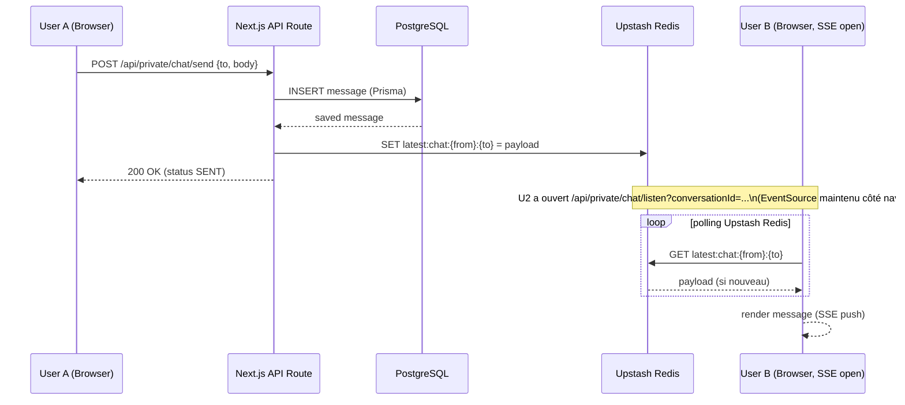
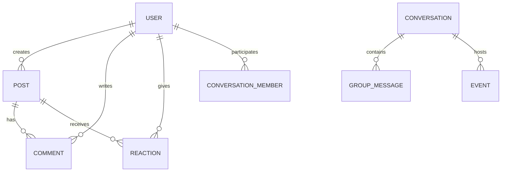

# 04 - Développement

## Objectif

Documenter l'architecture applicative, les endpoints API, l'authentification, le temps réel et la stratégie de tests/CI.

### 🔎 Preuves & Mapping GitHub

Les éléments techniques présentés ici sont issus des tickets et PRs du dépôt `arocchet/social-network` (références utiles pour le jury et la revue):

- PR stabilisation (Docker/Neon/Prisma/Redis): https://github.com/arocchet/social-network/pull/118
- DevOps / Docker / CI: https://github.com/arocchet/social-network/issues/40
- Socket/chat system: https://github.com/arocchet/social-network/issues/37
- Notifications & endpoints: https://github.com/arocchet/social-network/issues/39
- Database / Prisma migrations: https://github.com/arocchet/social-network/issues/45

Le socle technique a été stabilisé sur la base de ces sujets GitHub.

---

## Diagrammes d'Architecture (Mermaid)

### Architecture Système

```mermaid
graph LR
  subgraph Client
    Browser[Next.js (App Router)\nSSR/CSR Hybrid]
  end

  subgraph CDN
    Vercel[Vercel / Edge CDN]
  end

  subgraph Backend
    NextAPI[Next.js API Routes / App Router Server Actions]
    SSE[SSE Endpoints\n/api/private/chat/listen]
    Redis[Upstash Redis\nREST: cache + buffer de messages]
    Prisma[Prisma Client]
  end

  subgraph Infra
    Postgres[(PostgreSQL - Neon)]
    Storage[(Cloudinary - media storage)]
  end

  Browser --> Vercel
  Vercel --> NextAPI
  NextAPI --> Prisma
  Prisma --> Postgres
  NextAPI --> Redis
  SSE --> Redis
  Browser -- "EventSource / fetch stream" --> SSE
  NextAPI --> Storage
  Browser --> Storage

  classDef infra fill:#f3f4f6,stroke:#ccc;
  class Postgres,Storage infra;
```

### Auth Flow (Login)

```mermaid
sequenceDiagram
  participant B as Browser
  participant N as Next.js API
  participant P as Prisma

  B->>N: POST /api/public/auth/login {email, password}
  N->>P: SELECT user WHERE email
  P-->>N: user row
  N->>N: bcrypt.compare(password, user.password)
  N->>N: jose.SignJWT({userId}) signé avec JWT_SECRET
  N-->>B: Set-Cookie: authToken=<JWT>; HttpOnly; SameSite=Lax; 200 OK
```

Le JWT est validé par le middleware Next.js à chaque requête non publique (voir `src/middleware.ts`). Aucun NextAuth.js n'est utilisé : la stack auth est custom à base de `jose` + `jsonwebtoken` + `bcrypt`.

### Real-time Messaging Sequence (SSE + Upstash Redis)



Compromis assumé : Upstash Redis est un service REST (pas de pub/sub TCP). On polle la clé `latest:chat:*` côté endpoint SSE, ce qui suffit pour le volume de la formation et reste compatible serverless (Vercel).

### Schéma ER (Simplifié)



---

## Authentification & Middleware

- Auth custom (sans NextAuth) : JWT signé par `jose` (`jose.SignJWT`) avec un secret applicatif `JWT_SECRET`, stocké dans un cookie `authToken` (HttpOnly, SameSite=Lax).
- Le password est hashé avec `bcrypt` (12 rounds) avant insertion. La vérification se fait via `bcrypt.compare` au login.
- OAuth Google géré via `googleapis` (callback `/api/public/auth/callback`), pas via NextAuth. Le modèle Prisma `Account` est compatible NextAuth mais non utilisé par lui ici.
- Middleware Next.js (`src/middleware.ts`) :
  - protège **tout par défaut** via le matcher `'/((?!_next/static|_next/image|favicon.ico).*)'`,
  - laisse passer les routes publiques applicatives (`/login`, `/register`, `/palette`) et toutes les routes sous `/api/public/...`,
  - vérifie le cookie `authToken` via `verifyJwt`, redirige sur `/login` si invalide,
  - injecte un header `x-user-id` dans la requête pour les handlers downstream.
- Pas de session Redis : le JWT est auto-suffisant. L'invalidation forcée n'est pas implémentée et serait un ajout de roadmap (liste de révocation, version de token, ou TTL court + refresh).

> 📌 **Section dédiée :** l'ensemble des mesures de sécurité (authentification, protection contre XSS / CSRF / SQLi / clickjacking, headers HTTP, validation Zod, OAuth state, rate limiting) **et la conformité RGPD** (données collectées, droits de la personne concernée, durée de conservation, roadmap de durcissement) sont détaillées dans [securite-rgpd.md](./securite-rgpd.md). À consulter en priorité par le jury.

---

## Temps réel (Server-Sent Events + Upstash Redis)

- Le projet utilise **Server-Sent Events (SSE)** plutôt que des WebSockets. C'est suffisant pour le besoin (push serveur → client en chat 1‑to‑1 et 1‑to‑group), et compatible nativement avec l'exécution serverless de Vercel.
- Endpoint SSE: `GET /api/private/chat/listen?conversationId=...&type=direct|group` (voir `src/app/api/private/chat/listen/route.ts`). Le navigateur consomme le flux via un `EventSource` / `fetch` en streaming côté `src/hooks/use-real-time-chat.ts`.
- Côté serveur, chaque envoi de message (`POST /api/private/chat/send`) :
  1. persiste le message via Prisma dans PostgreSQL,
  2. écrit la dernière version dans Upstash Redis sous une clé `latest:chat:{from}:{to}` (ou `latest:chat:group:{groupId}`),
  3. répond au client expéditeur.
- L'endpoint SSE polle Upstash Redis (REST) pour cette clé et pousse les nouveaux messages dans le flux ouvert du destinataire.
- Événements applicatifs principaux :
  - `message:create` (DM / groupe) — publication via clé Redis dédiée
  - `message:status` (DELIVERED / READ) — via endpoints `/api/private/.../mark-seen` et `/status`
  - `typing` / `presence` — flux SSE séparé `/api/private/chat/typing/listen`
- Compromis assumé : Upstash Redis ne propose pas de pub/sub TCP, le polling est volontairement court mais reste un coût à surveiller. Pour passer à l'échelle, on basculerait vers un Redis classique en pub/sub ou un service managé type Ably / Pusher.

---

## 📡 Endpoints API

**Documentation Complète:** [api-spec.md](./api-spec.md)

### Résumé Rapide

**Auth (routes publiques, hors middleware) :**

- `POST /api/public/auth/login` — Connexion
- `POST /api/public/auth/register` — Inscription
- `POST /api/public/auth/logout` — Déconnexion
- `GET  /api/public/auth/redirect` — Redirection OAuth Google (initie le flux)
- `GET  /api/public/auth/callback` — Callback OAuth Google

**Users:**

- `GET /api/user/me` — ID utilisateur
- `GET /api/private/me` — Profil complet
- `PUT /api/private/me` — Modifier profil

**Posts:**

- `GET /api/private/post` — Lister posts
- `POST /api/private/post` — Créer post

**Stories:**

- `GET /api/private/stories` — Lister stories
- `POST /api/private/stories` — Créer story

**Messages:**

- `GET /api/private/messages` — Récupérer messages
- `GET /api/private/conversations` — Lister conversations

**Groupes:**

- `GET /api/private/groups` — Lister groupes
- `POST /api/private/groups` — Créer groupe

**Événements:**

- `GET /api/private/events` — Lister événements
- `POST /api/private/events` — Créer événement

**Amitié:**

- `GET /api/private/friend-requests` — Demandes reçues
- `POST /api/private/friend-requests` — Envoyer demande

**Recherche:**

- `GET /api/private/search` — Rechercher users/posts

**Invitations:**

- `GET /api/private/invitations` — Invitations groupe

**→ Voir [api-spec.md](./api-spec.md) pour détails complets (payloads, réponses, erreurs).**

---

## 🛠️ Implémentation - Code Samples

### Authentification (Middleware)

**`src/middleware.ts`** — Valide le JWT et injecte `x-user-id` sur toutes les routes non publiques :

```typescript
import { NextRequest, NextResponse } from "next/server";
import { verifyJwt } from "./lib/jwt/verifyJwt";

export async function middleware(req: NextRequest) {
  const { pathname } = req.nextUrl;

  // Routes publiques (pages)
  const publicRoutes = ["/login", "/register", "/palette"];
  const isPublicRoute = publicRoutes.some((r) => pathname.startsWith(r));

  // API publiques
  const isPublicApi = pathname.startsWith("/api/public");

  // Fichiers statiques images
  const imageExtensions = [".avif", ".jpg", ".jpeg", ".png", ".gif", ".svg", ".webp", ".ico", ".bmp"];
  const isImageRequest = imageExtensions.some((ext) => pathname.toLowerCase().endsWith(ext));

  if (isPublicRoute || isPublicApi || isImageRequest) {
    return NextResponse.next();
  }

  const token = req.cookies.get("authToken")?.value;
  if (!token) {
    return NextResponse.redirect(new URL("/login", req.url));
  }

  let payload = null;
  try {
    payload = await verifyJwt(token);
  } catch {
    return NextResponse.redirect(new URL("/login", req.url));
  }

  const requestHeaders = new Headers(req.headers);
  requestHeaders.set("x-user-id", payload.userId);
  return NextResponse.next({ request: { headers: requestHeaders } });
}

export const config = {
  // Match toutes les routes sauf les fichiers statiques Next.js
  matcher: ["/((?!_next/static|_next/image|favicon.ico).*)"],
};
```

### API Route Sample

**`src/app/api/private/post/route.ts`** — Créer et lister posts:

```typescript
import { NextRequest, NextResponse } from "next/server";
import { getUserIdFromRequest } from "@/lib/server/api/getUserId";
import { respondSuccess, respondError } from "@/lib/server/api/response";

export async function POST(req: NextRequest) {
  const userId = await getUserIdFromRequest(req);
  if (!userId) {
    return NextResponse.json(respondError("Unauthorized"), { status: 401 });
  }

  const formData = await req.formData();
  const message = formData.get("message") as string;
  const image = formData.get("image") as File;

  // Create post in database via Prisma
  const post = await db.post.create({
    data: {
      userId,
      message,
      image: image ? await uploadToCloudinary(image) : null,
      visibility: "PUBLIC",
    },
  });

  return NextResponse.json(respondSuccess(post), { status: 201 });
}
```

### Real-time (Server-Sent Events)

**`src/app/api/private/chat/listen/route.ts`** — endpoint SSE qui pousse les nouveaux messages dans un flux ouvert côté client :

```typescript
import { NextRequest } from "next/server";
import { redisdb } from "@/lib/server/websocket/redis";
import { getUserIdFromRequest } from "@/lib/server/api/getUserId";

export async function GET(request: NextRequest) {
  const userId = await getUserIdFromRequest(request);
  if (!userId) return new Response("Unauthorized", { status: 401 });

  const { searchParams } = new URL(request.url);
  const conversationId = searchParams.get("conversationId");
  const type = searchParams.get("type") || "direct";

  const stream = new ReadableStream({
    start(controller) {
      const encoder = new TextEncoder();
      controller.enqueue(encoder.encode(`data: ${JSON.stringify({ type: "connected" })}\n\n`));

      let isActive = true;
      let lastMessageId = "";

      // Polling Upstash Redis (REST) — pas de pub/sub TCP disponible
      (async function pollForMessages() {
        while (isActive) {
          const channels = type === "direct"
            ? [`latest:chat:${userId}:${conversationId}`, `latest:chat:${conversationId}:${userId}`]
            : [`latest:chat:group:${conversationId}`];

          for (const channel of channels) {
            const data = await redisdb.get(channel);
            if (data && (data as any).id && (data as any).id !== lastMessageId) {
              lastMessageId = (data as any).id;
              controller.enqueue(encoder.encode(`data: ${JSON.stringify(data)}\n\n`));
            }
          }
          await new Promise((r) => setTimeout(r, 1000));
        }
      })();

      request.signal.addEventListener("abort", () => {
        isActive = false;
        controller.close();
      });
    },
  });

  return new Response(stream, {
    headers: {
      "Content-Type": "text/event-stream",
      "Cache-Control": "no-cache, no-transform",
      Connection: "keep-alive",
    },
  });
}
```

Côté envoi, `POST /api/private/chat/send` persiste le message via Prisma puis met à jour la clé Redis `latest:chat:{from}:{to}` qui sera lue par le polling SSE du destinataire.

---

## 🧪 Tests & CI/CD

### Tests

**État actuel :**

- Tests d'intégration backend : Jest + `ts-jest` + `node --experimental-vm-modules` (voir `__tests__/integrations/authentification.test.ts`).
- Pas (encore) de framework E2E branché côté navigateur.

**Plan d'extension (roadmap dossier) :**

- Unit tests UI : Jest + React Testing Library sur les composants critiques (formulaires d'auth, feed, reactions).
- Tests d'intégration backend : étendre la couverture à `/api/private/post`, `/api/private/chat/send`, `/api/private/friend-requests`.
- E2E : ajouter Playwright (privilégié pour son setup TypeScript simple) sur les parcours « inscription → publication → réaction → suppression ».
- Tests contractuels SSE : valider le format `data: <json>\n\n` du flux temps réel.

**Sample test (`__tests__/integrations/authentification.test.ts`) — extrait :**

```typescript
import { POST } from "@/app/api/public/auth/register/route";
import { login } from "@/lib/server/user/login";
import { db } from "@/lib/db";
import { hashPassword } from "@/lib/security/hash";
import { NextRequest } from "next/server";

beforeAll(async () => {
  await db.user.create({
    data: {
      username: "testuser",
      email: "test@example.com",
      password: await hashPassword("password123"),
      firstName: "Test",
      lastName: "User",
      birthDate: new Date("1990-01-01"),
    },
  });
});

describe("POST /api/public/auth/register", () => {
  it("should register user and return success", async () => {
    const formData = new FormData();
    formData.append("username", `testuser_${Date.now()}`);
    formData.append("email", `testuser_${Date.now()}@example.com`);
    formData.append("password", "password123");
    formData.append("firstname", "Test");
    formData.append("lastname", "User");
    formData.append("dateOfBirth", "1990-01-01");

    const req = { formData: async () => formData } as unknown as NextRequest;
    const res = await POST(req);

    expect(res.status).toBe(200);
    const json = await res.json();
    expect(json.success).toBe(true);
  });
});
```

### GitHub Actions (CI/CD)

**`.github/workflows/ci.yml`:**

```yaml
name: CI

on: [push, pull_request]

jobs:
  test:
    runs-on: ubuntu-latest
    steps:
      - uses: actions/checkout@v4
      - uses: oven-sh/setup-bun@v1
        with:
          bun-version: "1"

      - run: bun install --frozen-lockfile
      - run: bunx prisma generate
      - run: bun run lint
      - run: bun run test
      - run: bun run build
```

> Le projet utilise **Bun** comme package manager et runtime, en cohérence avec `bun.lock` et le `Dockerfile` (image `oven/bun:1`).

---

## 📚 Structure de Code

### Directories Clés

```
src/
├── app/
│   ├── api/
│   │   ├── auth/          # Endpoints authentification
│   │   ├── private/       # Routes protégées
│   │   │   ├── post/      # Posts CRUD
│   │   │   ├── messages/  # Messages
│   │   │   ├── groups/    # Groupes
│   │   │   ├── events/    # Événements
│   │   │   ├── stories/   # Stories
│   │   │   └── ...
│   │   └── public/        # Routes publiques
│   ├── (feed)/            # Pages feed
│   ├── (auth)/            # Pages auth
│   └── layout.tsx
├── components/
│   ├── feed/              # Post cards, feed
│   ├── chat/              # Messages UI
│   ├── groups/            # Groups UI
│   └── ...
├── hooks/
│   ├── use-api.ts         # Fetch helper
│   ├── use-post-data.ts   # Posts logic
│   ├── use-conversations.ts  # Messages logic
│   └── ...
├── lib/
│   ├── db/                # Prisma client
│   ├── server/            # Server utils
│   │   ├── api/           # API response helpers
│   │   ├── user/          # User queries
│   │   ├── post/          # Post queries
│   │   └── websocket/     # Client Upstash Redis (réutilisé par les endpoints SSE)
│   ├── schemas/           # Zod validators
│   └── utils/             # Helpers
└── middleware.ts          # Auth middleware
```

### Validation & Error Handling

- **Schemas:** Zod + TypeScript interfaces in `src/lib/schemas/`
- **Response Format:** `respondSuccess()` / `respondError()` helpers
- **Status Codes:** 200, 201, 400, 401, 403, 404, 500
- **Validation Errors:** Detailed field errors in response

---

## ✅ Checklist Implémentation

- [x] Auth (JWT + HTTP-only cookies + middleware)
- [x] API routes (20+ endpoints documentés)
- [x] Database (Prisma + 18 models)
- [x] Real-time (Server-Sent Events + Upstash Redis)
- [x] Error handling (validation + exceptions)
- [x] File uploads (Cloudinary integration)
- [x] Pagination (infinite scroll)
- [ ] Rate limiting (optionnel)
- [ ] Caching strategies (Redis optimization)
- [ ] Full test suite
- [ ] API documentation (Swagger/OpenAPI optionnel)

---

## 🚀 Prochaines Étapes

1. **Section 05 - Déploiement:** Docker, CI/CD, Monitoring
2. **Section 06 - Bilan:** Métriques, challenges, learnings
3. **Section 07 - Annexes:** Diagrams, configuration samples
4. **Validation Jury:** Réviser, corriger feedback

---

**Last Updated:** 2026-05-04  
**Version:** 1.1
