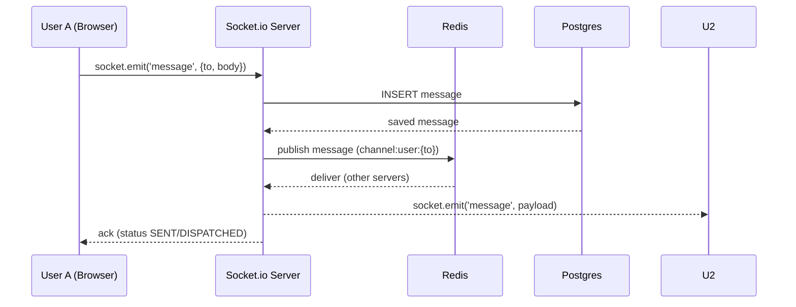
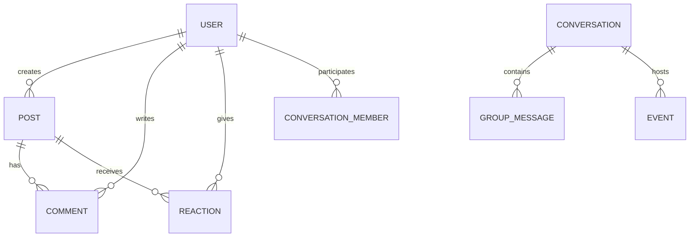

# 04 - Développement

## Objectif

Documenter l'architecture applicative, les endpoints API, l'authentification, le temps réel et la stratégie de tests/CI.

### 🔎 Preuves & Mapping GitHub

Les éléments techniques présentés ici sont issus des tickets et PRs du dépôt `arocchet/social-network` (références utiles pour le jury et la revue):

- PR stabilisation (Docker/Neon/Prisma/Redis): https://github.com/arocchet/social-network/pull/118
- DevOps / Docker / CI: https://github.com/arocchet/social-network/issues/40
- Socket/chat system: https://github.com/arocchet/social-network/issues/37
- Notifications & endpoints: https://github.com/arocchet/social-network/issues/39
- Database / Prisma migrations: https://github.com/arocchet/social-network/issues/45

Le socle technique a été stabilisé sur la base de ces sujets GitHub.

---

## Diagrammes d'Architecture (Mermaid)

### Architecture Système

```mermaid
graph LR
  subgraph Client
    Browser[Next.js (App Router)\nSSR/CSR Hybrid]
  end

  subgraph CDN
    Vercel[Vercel / Edge CDN]
  end

  subgraph Backend
    NextAPI[Next.js API Routes / App Router Server Actions]
    Socket[Socket.io Server]
    Redis[Redis (pub/sub, cache, sessions)]
    Prisma[Prisma Client]
  end

  subgraph Infra
    Postgres[(PostgreSQL - Neon)]
    Storage[(Cloudinary - media storage)]
  end

  Browser --> Vercel
  Vercel --> NextAPI
  NextAPI --> Prisma
  Prisma --> Postgres
  NextAPI --> Redis
  Socket --> Redis
  Browser --> Socket
  NextAPI --> Storage
  Browser --> Storage

  classDef infra fill:#f3f4f6,stroke:#ccc;
  class Postgres,Storage infra;
```

### Auth Flow (Login)

```mermaid
sequenceDiagram
  participant B as Browser
  participant N as Next.js API
  participant P as Prisma
  participant R as Redis

  B->>N: POST /api/auth/login {email,password}
  N->>P: SELECT user WHERE email
  P-->>N: user row
  N->>N: verify password, create JWT
  N->>R: store session (uuid -> userId)
  N-->>B: set-cookie HttpOnly JWT; 200 OK
```

### Real-time Messaging Sequence



### Schéma ER (Simplifié)



---

## Authentification & Middleware

- Auth via JWT stocké en cookie HTTP-only; refresh tokens optionnels.
- Middleware Next.js valide JWT sur routes protégées (server-side) et redirige vers `/login` si absent/expiré.
- Sessions courtes côté serveur (Redis) pour invalidation forcée et gestion multi-device.

Pattern recommandé:

- `middleware.ts` vérifie cookie, charge user id, attache `request.user` pour handlers.

---

## Temps réel (Socket.io)

- Socket.io côté serveur utilise Redis adapter pour scalabilité multi-instance.
- Evénements principaux:
  - `message:create` (DM / groupe)
  - `message:status` (DELIVERED / READ)
  - `notification:new`
  - `typing` / `presence`
- Persist messages via Prisma → PostgreSQL, puis publier via Redis pub/sub pour diffusion.

---

## 📡 Endpoints API

**Documentation Complète:** [api-spec.md](./api-spec.md)

### Résumé Rapide

**Auth:**

- `POST /api/auth/login` — Connexion
- `POST /api/auth/register` — Inscription
- `POST /api/auth/logout` — Déconnexion

**Users:**

- `GET /api/user/me` — ID utilisateur
- `GET /api/private/me` — Profil complet
- `PUT /api/private/me` — Modifier profil

**Posts:**

- `GET /api/private/post` — Lister posts
- `POST /api/private/post` — Créer post

**Stories:**

- `GET /api/private/stories` — Lister stories
- `POST /api/private/stories` — Créer story

**Messages:**

- `GET /api/private/messages` — Récupérer messages
- `GET /api/private/conversations` — Lister conversations

**Groupes:**

- `GET /api/private/groups` — Lister groupes
- `POST /api/private/groups` — Créer groupe

**Événements:**

- `GET /api/private/events` — Lister événements
- `POST /api/private/events` — Créer événement

**Amitié:**

- `GET /api/private/friend-requests` — Demandes reçues
- `POST /api/private/friend-requests` — Envoyer demande

**Recherche:**

- `GET /api/private/search` — Rechercher users/posts

**Invitations:**

- `GET /api/private/invitations` — Invitations groupe

**→ Voir [api-spec.md](./api-spec.md) pour détails complets (payloads, réponses, erreurs).**

---

## 🛠️ Implémentation - Code Samples

### Authentification (Middleware)

**`src/middleware.ts`** — Valide JWT et charge user ID sur routes protégées:

```typescript
import { NextRequest, NextResponse } from "next/server";

export function middleware(request: NextRequest) {
  const token = request.cookies.get("auth_token")?.value;

  // Redirect to login if no token
  if (!token && request.nextUrl.pathname.startsWith("/api/private")) {
    return NextResponse.json({ error: "Unauthorized" }, { status: 401 });
  }

  // Continue if token exists or public route
  return NextResponse.next();
}

export const config = {
  matcher: ["/api/private/:path*", "/(feed)/:path*"],
};
```

### API Route Sample

**`src/app/api/private/post/route.ts`** — Créer et lister posts:

```typescript
import { NextRequest, NextResponse } from "next/server";
import { getUserIdFromRequest } from "@/lib/server/api/getUserId";
import { respondSuccess, respondError } from "@/lib/server/api/response";

export async function POST(req: NextRequest) {
  const userId = await getUserIdFromRequest(req);
  if (!userId) {
    return NextResponse.json(respondError("Unauthorized"), { status: 401 });
  }

  const formData = await req.formData();
  const message = formData.get("message") as string;
  const image = formData.get("image") as File;

  // Create post in database via Prisma
  const post = await db.post.create({
    data: {
      userId,
      message,
      image: image ? await uploadToCloudinary(image) : null,
      visibility: "PUBLIC",
    },
  });

  return NextResponse.json(respondSuccess(post), { status: 201 });
}
```

### Real-time Socket.io

**`src/lib/server/websocket/socket.ts`** — Gère messages en temps réel:

```typescript
import { Server } from "socket.io";
import { createAdapter } from "@socket.io/redis-adapter";
import { redisdb } from "./redis";

export function initializeSocket(httpServer: any) {
  const io = new Server(httpServer, {
    adapter: createAdapter(redisdb, redisdb),
  });

  io.on("connection", (socket) => {
    socket.on("message:create", async (payload) => {
      // Save to database
      const msg = await db.message.create({ data: payload });
      // Publish via Redis for multi-instance
      io.to(payload.receiverId).emit("message:create", msg);
    });

    socket.on("typing", (data) => {
      socket.broadcast.to(data.conversationId).emit("typing", data);
    });
  });
}
```

---

## 🧪 Tests & CI/CD

### Tests

**Stratégie recommandée:**

- Unit tests: Jest + React Testing Library
- Integration tests: Playwright or Cypress (end-to-end)
- Backend tests: supertest + Jest for API routes
- Contract tests for real-time events (optionnel)

**Sample test (`__tests__/integrations/auth.test.ts`):**

```typescript
import { POST } from "@/app/api/auth/login/route";

describe("POST /api/auth/login", () => {
  it("should login with valid credentials", async () => {
    const req = new Request(new URL("http://localhost/api/auth/login"), {
      method: "POST",
      body: JSON.stringify({
        email: "test@example.com",
        password: "password123",
      }),
    });

    const response = await POST(req as any);
    expect(response.status).toBe(200);
  });
});
```

### GitHub Actions (CI/CD)

**`.github/workflows/ci.yml`:**

```yaml
name: CI

on: [push, pull_request]

jobs:
  test:
    runs-on: ubuntu-latest
    steps:
      - uses: actions/checkout@v3
      - uses: actions/setup-node@v3
        with:
          node-version: "18"

      - run: npm install
      - run: npm run lint
      - run: npm run test
      - run: npm run build
```

---

## 📚 Structure de Code

### Directories Clés

```
src/
├── app/
│   ├── api/
│   │   ├── auth/          # Endpoints authentification
│   │   ├── private/       # Routes protégées
│   │   │   ├── post/      # Posts CRUD
│   │   │   ├── messages/  # Messages
│   │   │   ├── groups/    # Groupes
│   │   │   ├── events/    # Événements
│   │   │   ├── stories/   # Stories
│   │   │   └── ...
│   │   └── public/        # Routes publiques
│   ├── (feed)/            # Pages feed
│   ├── (auth)/            # Pages auth
│   └── layout.tsx
├── components/
│   ├── feed/              # Post cards, feed
│   ├── chat/              # Messages UI
│   ├── groups/            # Groups UI
│   └── ...
├── hooks/
│   ├── use-api.ts         # Fetch helper
│   ├── use-post-data.ts   # Posts logic
│   ├── use-conversations.ts  # Messages logic
│   └── ...
├── lib/
│   ├── db/                # Prisma client
│   ├── server/            # Server utils
│   │   ├── api/           # API response helpers
│   │   ├── user/          # User queries
│   │   ├── post/          # Post queries
│   │   └── websocket/     # Socket.io setup
│   ├── schemas/           # Zod validators
│   └── utils/             # Helpers
└── middleware.ts          # Auth middleware
```

### Validation & Error Handling

- **Schemas:** Zod + TypeScript interfaces in `src/lib/schemas/`
- **Response Format:** `respondSuccess()` / `respondError()` helpers
- **Status Codes:** 200, 201, 400, 401, 403, 404, 500
- **Validation Errors:** Detailed field errors in response

---

## ✅ Checklist Implémentation

- [x] Auth (JWT + HTTP-only cookies + middleware)
- [x] API routes (20+ endpoints documentés)
- [x] Database (Prisma + 18 models)
- [x] Real-time (Socket.io + Redis adapter)
- [x] Error handling (validation + exceptions)
- [x] File uploads (Cloudinary integration)
- [x] Pagination (infinite scroll)
- [ ] Rate limiting (optionnel)
- [ ] Caching strategies (Redis optimization)
- [ ] Full test suite
- [ ] API documentation (Swagger/OpenAPI optionnel)

---

## 🚀 Prochaines Étapes

1. **Section 05 - Déploiement:** Docker, CI/CD, Monitoring
2. **Section 06 - Bilan:** Métriques, challenges, learnings
3. **Section 07 - Annexes:** Diagrams, configuration samples
4. **Validation Jury:** Réviser, corriger feedback

---

**Last Updated:** 2026-05-04  
**Version:** 1.0

# 04 - Développement

## 🏗️ Architecture Générale

### Stack Technologique

```
Frontend:
├── Next.js 14+ (React Framework)
├── TypeScript (Type Safety)
├── Tailwind CSS (Styling)
├── React Query/SWR (Data Fetching)
└── Zustand/Jotai (State Management)

Backend:
├── Next.js API Routes
├── Prisma (ORM)
├── PostgreSQL (Database)
├── Redis (Caching/Sessions)
└── Socket.io (Real-time)

Infrastructure:
├── Docker (Containerization)
├── Neon (Serverless PostgreSQL)
├── Vercel (Hosting)
├── GitHub Actions (CI/CD)
└── Sentry (Monitoring)
```

---

## 📁 Structure du Projet

```
src/
├── app/                     # Next.js App Router
│   ├── (auth)/             # Route group authentification
│   ├── (protected)/        # Route group protégées
│   ├── api/                # API endpoints
│   └── components/         # Components réutilisables
├── lib/                    # Utilitaires et helpers
│   ├── db.ts              # Prisma client
│   ├── auth.ts            # Logique authentification
│   └── validators.ts      # Validation données
├── hooks/                  # Custom React hooks
├── types/                  # Typage TypeScript
├── middleware.ts           # Middlewares Next.js
└── prisma/
    ├── schema.prisma       # Modèle de données
    └── migrations/         # Historique migrations
```

---

## 🗄️ Modèle de Données

### Entités Principales

- **User:** Profil utilisateur
- **Post:** Article/Tweet publié
- **Comment:** Commentaire sur post
- **Message:** Message privé
- **Follow:** Relation de suivi
- **Like:** Réaction à un post/comment
- **Group:** Communauté/Groupe
- **Notification:** Alerte utilisateur

---

## 🔐 Authentification

### Stratégie

- JWT tokens pour API
- Cookies HTTP-only pour sessions
- Refresh tokens
- Rate limiting

### Implémentation

- NextAuth.js (optionnel)
- JWT avec secret
- Password hashing: bcrypt

---

## 🔄 Communication Temps Réel

### WebSocket / Socket.io

- Notifications en direct
- Live messaging
- User presence
- Activity feed updates

---

## 🧪 Tests

- [ ] Unit Tests (Jest)
- [ ] Integration Tests (Testing Library)
- [ ] E2E Tests (Cypress/Playwright)
- [ ] Performance Tests (Lighthouse)

---

## 📊 Monitoring et Logs

- Error tracking: Sentry
- Performance: Vercel Analytics
- Logs: Console/Datadog

---

## 🚀 Optimisations

- [ ] Code splitting
- [ ] Image optimization
- [ ] Database indexing
- [ ] Caching strategy
- [ ] Compression (gzip/brotli)
